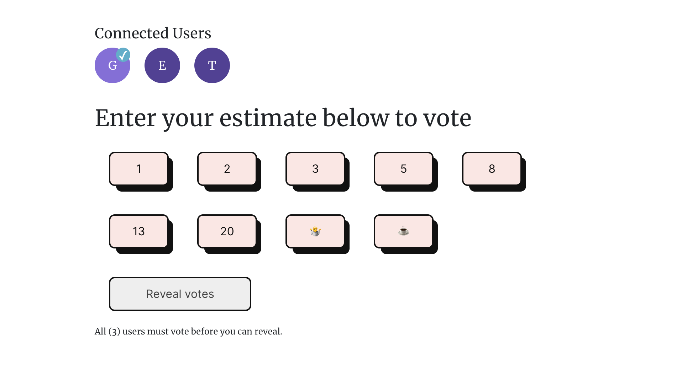

# Planning Poker 2023

## Problem statement

My favourite planning poker isn't free any more.

## Overview

I built this on a train

It probably works, but could do with typescript, tests, etc, and there's no nodemon to make development easier



## How to run the app?

```bash
#-- Setup and start the server
cd server
npm install # or yarn install
npm start # or yarn start

#-- Setup and start the client
cd client
npm install # or yarn install
npm start # or yarn start
```

## Future features

Sans priorité

- Routing and more pages (about, FAQ, T&Cs)
- More than one room
- Link sharing (after routing)
- Custom points/sizes
- Suggest user name from previous session

## License

[MIT](LICENSE)
